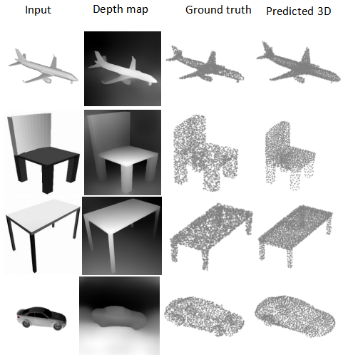

DepthCloud2Point: Depth Maps and Initial Point for 3D Point Cloud Reconstruction from a Single Image

- Galana Fekadu Asafa, Shengbing Ren, Sheikh Sohan Mamun, and Kaleb Amsalu Gobena. “DepthCloud2Point: Depth Maps and Initial Point for 3D Point Cloud Reconstruction from a Single Image”.
In: Electronics 14.6 (Apr. 2025). url: https://doi.org/10.3390/electronics14061119.




## Environment

``` bash
conda env create -f ./environment.yml
conda activate DepthCloud2Point
```

The code has been tested on Ubuntu 20.04, Python 3.9.13, Pytorch 1.12.1, Pytorch3D 0.7.0, CUDA 11.7

### EMD Loss Function

The Earth Mover's Distance of point clouds is from: [Colin97/MSN-Point-Cloud-Completion: Morphing and Sampling Network for Dense Point Cloud Completion (AAAI2020)](https://github.com/Colin97/MSN-Point-Cloud-Completion/tree/master/emd)

## Dataset

- Shapenet Point cloud (shapenetcorev2_hdf5_2048.zip,
  0.98G): [antao97/PointCloudDatasets](https://github.com/antao97/PointCloudDatasets)
- Shapenet renderer (image.tar,
  30G): [Xharlie/ShapenetRender_more_variation](https://github.com/Xharlie/ShapenetRender_more_variation)

> required to modify the dataset path in the `./lib/settings.py`

## Training

``` bash
python main.py
```

## Testing

```bash
python test.py
```

> required to modify the model path in `./lib/settings.py`
